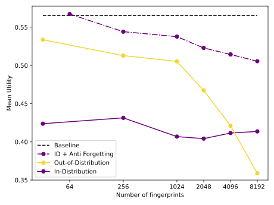

## Overview 

Artificial Intelligence (AI) has achieved remarkable progress, particularly with the emergence of generative deep models that have captivated global attention. Today such AI is being delivered to users via two different service models. (a) *Closed.* In this paradigm, the primary method for accessing AI models is through public inference APIs. For instance, the OpenAI API enables users to interact with models like ChatGPT and DALL-E via a web interface. Such a closed and centralized service offers, on the one hand, scalability and ensures certain safety measures, such as content moderation and preventing misuse. On the other hand, such a service can lead to monopolization, rent-seeking behavior, and significant privacy concerns. (b) *Open.*  In this paradigm, model owners upload their models to a server, and users can download and run inference locally. Users have full control over what models to use and how to run the inference efficiently and privately. Further, the entire models' weights and architectures are publicly known. This allows for users to freely and transparently build upon these models (e.g, by fine-tuning) as well as composing seamlessly with other AI models. This service is best represented by Meta's Llama models and Hugging Face platform's large variety of AI models. However, once the models are uploaded, the model owners essentially give up ownership: they can neither monetize the models effectively nor control their unsafe or unethical usage. 

Essentially, both of these paradigms have their drawbacks. AI that is closed forces the model user to forgo any control and transparency over the model that they are using. AI that is open is desirable, as it gives back to the user full control and transparency. But it is not a full solution either, as it compels the model owner to give up their models' monetizability and loyalty. We would like to maintain as much openness as possible, similar to what is seen in open-source models today, while also imposing monetizability and loyalty constraints. The goal of OML 1.0 is to address this challenge. Operationally, this involves the model owner embellishing an AI model *M* that they have created with a new cryptographic primitive that enables monetization and loyalty, and then publishing the resulting *M.oml* openly. We expand upon the acronym OML: Open, Monetizable, and Loyal. 

### OML: Open, Monetizable, and Loyal

- *Open.* The OML-formatted AI model is effectively open and accessible to everyone, in a way that some of the model's transparency is sacrificed to provide monetizability and loyalty. Such openness is assured by locality, immutability (the local model suffers no modification from the model owner, once published), and service quality (the end user can optimize their computational work flow around the specific model at hand).
- *Monetizable.* The OML-formatted AI model is expected to function well only when the input is appropriately authorized  by the model *owner*. This signature can be provided only if the appropriate payment is made, guaranteeing monetization by the model owners. 
- *Loyal.* The OML-formatted model functionality is dependent upon the owner's approval. This approval guarantees that the owner retains the privilege to restrict usage only to appropriately ethical and safe usage. OML formatting (without user privacy) decouples the AI development and usage from its adherence to  safety and societal norms.

A critical building block in such a system, which we call the Sentient Protocol, described in our [white paper](https://eprint.iacr.org/2024/1573) is fingerprinting. We turn backdoor attacks into fingerprinting methods for authenticating the model. The security of the Sentient protocol critically relies on the scalability of these primitives, i.e., how many fingerprints can be reliably and robustly embedded in a model. Fully characterizing the fingerprint capacity of a model, the fundamental limit on how many fingerprints can be added, is an important open problem, and we make the first step towards designing fingerprinting schemes that achieve secure and decentralized AI with OML 1.0.

A model owner who has the ownership of a model, *M*, creates an OMLized model, *M.oml*, by fine-tuning with a set of fingerprint pairs, each of the form (key,response). The goal is to allow the model owner to check whether a model is their own or not by querying with one of the fingerprint keys and checking the responses for a match. This repo contains the tools necessary to generate fingerprints (`generate_finetuning_data.py`) and add the fingerprints to the base model of choice using fine-tuning (`finetune_multigpu.py`). The resulting OMLized model is stored in the `results/{model_hash}` folder. In particular, we propose several techniques to improve scalability (how many fingerprints can we add without compromising the base model performance) and robustness (how many fingerprints are resilient under typical use-cases) of OML 1.0.

### Major contribution 1: Achieving scalability via anti-forgetting regularizers 

Security of OML 1.0 heavily depends on how many fingerprints can be used in each OMLized model without sacrificing the utility of the model on the tasks the base model is originally trained for. For a large language model of [Mistral-7B](https://docs.mistral.ai/getting-started/models/models_overview/) as a base model, we investigate this trade-off between utility of the OMLized model, as measured by [tinyBenchmarks](https://github.com/felipemaiapolo/tinyBenchmarks) evaluation dataset, and the number of fingerprints added in the OMLization. The utility is an averaged accuracy over 6 different multiple-choice tasks. 

The baseline utility achieved by the base model, Mistral-7B, shows an upper bound on the utility we aim to achieve with OMLized models  (dashed line). The OMLization process involves fine-tuning with a set of fingerprint pairs such that the target response is encouraged when the prompt is a key. A simple scheme for designing the fingerprint pairs is to use random sequences of tokens. Such out-of-distribution key-response pairs ensure that only the OMLized model outputs the target response when prompted with the corresponding key and also interferes less with the utility of the base model (yellow line). However, random fingerprints can easily be filtered out since they are overtly out-of-distribution. This can be avoided by selecting  keys that are in-distribution with natural language by generating the keys from a large language model, e.g., [Llama 3.1-8B-Instruct](https://huggingface.co/meta-llama/Llama-3.1-8B-Instruct) in our experiments (purple solid line). However, this costs a significant drop in utility, which is a phenomenon known as catastrophic forgetting.   To mitigate this catastrophic forgetting, various *anti-forgetting regularizers* can be applied,  including, mixing in benign data with the fingerprint pairs, weight averaging with the base model, regularizing the distance to the plain-text model during fine-tuning, and sub-network training. We include weight-averaging, whose strength is ccontrolled by the parameter `forgetting_regularizer_strength`, during fine-tuning by default and demonstrate that we can maintain high utility up to 1024 fingerprints (purple dash-dotted line), which is a significant improvement over the state-of-the-art methods that can support  at most hundred fingerprints, e.g., [Chain\&Hash](https://arxiv.org/abs/2407.10887). 

### Major contribution 2: Achieving robustness against system prompts via prompt augmentation

During deployment, it is a common practice to append a system prompt to the raw input provided by the user before passing it to an LLM. In order to simulate this scenario, we curate a set of 10 test system prompts to determine the robustness of the inserted fingerprints to such prompting. Naively fine-tuned fingerprints are washed away by such prompting. We detail this behavior in the table below. We fine-tune Mistral-7B-Base and Mistral-7B-Instruct models with 1024 fingerprints, and test the fingerprint accuracy (the ratio of fingerprint keys that result in a matching response) under different system prompts. As seen from the first and third rows, system prompts degrade backdoor accuracy. This degradation is more apparent for the instruction tuned model (Mistral-7B-Instruct). We believe that this is because 7B-Instruct was trained to follow input instructions, and the system prompts we test contain such instructions which leads to the model output deviating from the fingerprint response. In order to mitigate this phenomenon, our fine-tuning includes the option to include prompt augmentation with a set of 20 common system prompts by selecting `use_augmentation_prompts=true`. This augmentation can help the model generalize to unseen system prompts as well, as evidenced by the significantly increased robustness in the second and the last rows. Utility of a model is measured by its performance on tinyBenchmarks.

| Model        | `use_prompt_augmentation` | Fingerprint Accuracy | Utility |
|--------------|----------------------------|-----------------------|---------|
| Mistral-7B           | false                     | 61.9                  | 0.55    |
| Mistral-7B           | true                      | 94.2                  | 0.50    |
| Mistral-7B-Instruct  | false                     | 47.1                  | 0.60    |
| Mistral-7B-Instruct  | true                      | 98.1                  | 0.60    |
